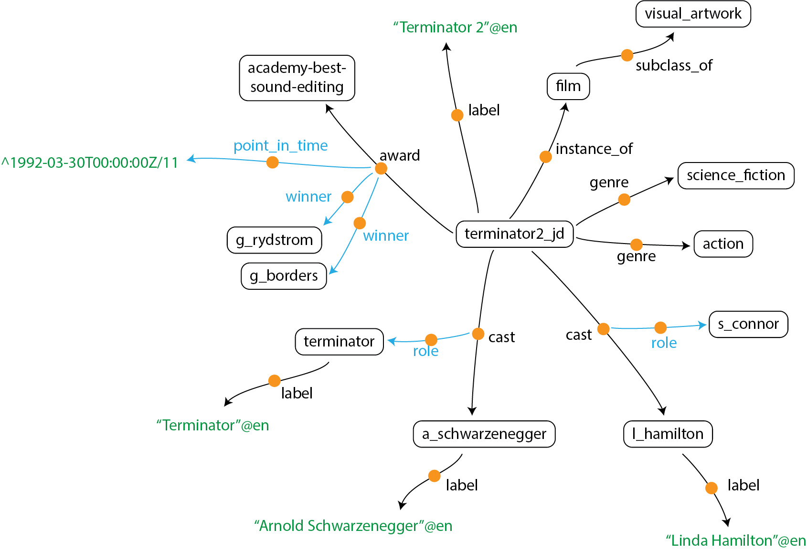

# KGTK Data Model

The KGTK data model represents knowledge graphs (KG) as a set of nodes and edges, as shown in the figure below that shows a partial KG for the Terminator 2 movie. KGTK uses nodes to represent entities (e.g., `terminator2_jd` or `action`), literals (e.g., `"Terminator 2"@en`), dates (e.g., `^1992-03-30T00:00:00Z/11`) and other types of literals (see full specification). A notable feature of KGTK is that edges are also nodes, depicted in the figure using the orange circles. Given that edges are nodes, it is possible to define edges that connect edges to other nodes, as illustrated using the blue arrows.

For example, we can represent that the terminator movie received an academy award for best sound editing by using an edge labeled `award` between `terminator2_jd` and `academy-best-sound-editing`. We can represent that the award was given on March 30, 1992 by using an edge labeled `point_in_time` from the award edge to `^1992-03-30T00:00:00Z/11`, and we can also represent that the award was given to Gary Rydstrom and Gloria Borders using two additional edges labeled `winner`.

## File Format

KGTK represents KGs using TSV files with 4 columns labeled `id`, `node1`, `label` and `node2`. The `id` column is a symbol representing an identifier of an edge, corresponding to the orange circles in the diagram above. `node1` represents the source of the edge, `node2` represents the destination of the edge, and `label` represents the relation between `node1` and `node2`.  Note that the identifiers of edges (e.g., `t4`) is used in the `node1` column to represent an edge whose source is the edge with identifier `t4`. See File Format for the full specification of the KGTK file format.

| id  | node1      | label       | node2                 |
|-----|------------|-------------|-----------------------|
| t1  | terminator2_jd | label       | "Terminator 2"@en     |
| t2  | terminator2_jd | instance_of | film                  |
| t3  | terminator2_jd | genre       | science_fiction       |
| t3  | terminator2_jd | genre       | action                |  
| t4  | terminator2_jd | cast        | a_schwarzenegger      |
| t5  | t4             | role        | terminator            |  
| t6  | terminator2_jd | cast        | l_hamilton            |
| t7  | t4             | role        | s_connor              |
| t8  | terminator2_jd | award       | academy-best-sound-editing              |    
| t9  | t8             |  point_in_time | ^1992-03-30T00:00:00Z/11  |
| t10 | t8             |  winner     | g_rydstrom            |
| t11 | t8             |  winner     | g_borders             |
| t12 | l_hamilton     |  label      | "Linda Hamilton"@en   |
| t13 | a_schwarzenegger |  label      | "Arnold Schwarzenegger"@en |
| t14 | film           |  subclass_of | visual_artwork |

## Relationship To Other KG Data Models

The KGTK data model is a generalization of popular data models used to represent KGs.

### Relationship To Property Graphs
Property graphs are a popular data model where sets of attribute/value pairs can be attached to nodes and edges. The KGTK model is a generalization of property graphs because the attribute/value pairs are also edges: the attributes are relations and the values can be arbitrary nodes.

### Relationship to RDF
RDF graphs represent KGs using subject/predicate/object triples, corresponding to the node1/label/node2 columns in KGTK. To represent edges about edges, it is necessary to use reification, typically done using `rdf:Statement`, where the edges are representing using three triples. The KGTK representation is simpler as it does not require the creation of extra triples to represent the edges.

RDF also supports quads, where a fourth element is used to represent a graph. In KGTK the fourth element is an identifier for an edge (every edge has a unique identifier). The KGTK data model is significantly more flexible as it is possible to associate edges with multiple graphs by using multiple edges on edges.

### Relationship To RDF*
RDF* is a generalization of RDF that allows using triples in the subject of  triples.  In KGTK, the same effect is achieved by using the identifier of an edge as the `node1` of an edge. KGTK is more flexible in that identifiers of edges can also be used in the `node2` position. Furthermore, in KGTK it is possible to define two edges with identical `node1/label/node2` values but different identifiers, making it possible to associate different sets of secondary edges with the same subject/predicate/object triple. This is useful in cases where the same subject/predicate/object triples has different provenance information.

### Relationship to Wikidata
The KGTK data model is most similar to the Wikidata data model where it is possible to define qualifiers and references for statements. In Wikidata it is not possible to define qualifiers and references on qualifiers, so it is not possible, for example, to represent provenance of qualifiers. KGTK supports definition of an arbitrary number of levels of edges on edges.
